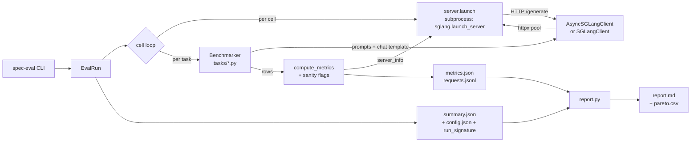

# spec-eval

EAGLE-2 / **EAGLE-3** speculative-decoding eval pipeline for **SGLang**, managed with **UV**.

Mirrors the [SpecForge benchmarker](https://github.com/sgl-project/SpecForge/tree/main/benchmarks/benchmarker)
layout (base class + registry + per-dataset modules), but talks to SGLang over
HTTP `/generate` so the eval venv stays lean — no `import sglang` in the eval
code, just a subprocess that runs `python -m sglang.launch_server`.

For each (task × spec-config × seed) cell the pipeline reports:

- **Task accuracy** — per-benchmark quality metric (where gradable).
- **Acceptance metrics** — `accept_length`, Leviathan α, tree accept rate, accept histogram, per-prompt distribution.
- **Throughput / latency** — wall-clock TPS, e2e/inference/queue percentiles, decode TPS, p20 step time from `/server_info`.
- **Cache & memory pressure** — radix-cache hit rate, cached prompt tokens, retraction count.
- **Sanity flags** — cheap rule-based response checks (repetition, prompt-echo, system-leak, etc.).
- **Provenance** — drafter SHA256, git SHA, per-task sampling config, started UTC.

Full glossary in [§ Metrics reference](#metrics-reference).

---

## Table of contents

- [Quick start](#quick-start)
- [Makefile](#makefile)
- [EAGLE-3 support](#eagle-3-support)
- [Benchmarks](#benchmarks)
- [CLI reference](#cli-reference)
- [Metrics reference](#metrics-reference)
- [Output layout](#output-layout)
- [Concurrency](#concurrency)
- [Architecture](#architecture)
- [Glossary](#glossary)
- [Contributing](#contributing)
- [Notes](#notes)

---

## Quick start

```bash
# 1. Create the eval venv
make setup                          # = uv sync

# 2. On a GPU box, install sglang in the SAME venv
make install-sglang                 # = uv pip install "sglang[all]>=0.5"

# 3. EAGLE-2 against Llama-3.1-8B (algorithm auto-detected from drafter)
make run-eagle2 \
    TARGET=meta-llama/Llama-3.1-8B-Instruct \
    DRAFT=yuhuili/EAGLE-LLaMA3.1-Instruct-8B

# 4. EAGLE-3 against Llama-3.1-8B
make run-eagle3 \
    TARGET=meta-llama/Llama-3.1-8B-Instruct \
    DRAFT_EAGLE3=lmsys/sglang-EAGLE3-LLaMA3.1-Instruct-8B

# 5. Sweep baseline + EAGLE-2 + EAGLE-3 trees in one boot
make run-sweep \
    TARGET=meta-llama/Llama-3.1-8B-Instruct \
    DRAFT_EAGLE3=lmsys/sglang-EAGLE3-LLaMA3.1-Instruct-8B

# 6. Compare baseline vs spec
make compare BASELINE_DIR=results/baseline SPEC_DIR=results/eagle2
```

Or call the CLI directly:

```bash
uv run spec-eval run \
  --target meta-llama/Llama-3.1-8B-Instruct \
  --draft  lmsys/sglang-EAGLE3-LLaMA3.1-Instruct-8B \
  --tasks english --num-samples 50
```

---

## Makefile

```bash
make help            # list every target + variable
make setup           # uv sync (no sglang)
make install-sglang  # uv pip install "sglang[all]>=0.5"

# Inspection (no GPU)
make list-tasks
make audit TARGET=... DRAFT=...
make smoke-test                              # offline metric/helper checks

# Eval runs (variables: TARGET, DRAFT[_EAGLE3], TASKS, N, SEEDS, CONCURRENCY, RUN_NAME)
make run-baseline TARGET=... TASKS=english
make run-eagle2   TARGET=... DRAFT=...
make run-eagle3   TARGET=... DRAFT_EAGLE3=...
make run-sweep    TARGET=... DRAFT_EAGLE3=...

# Reports
make report  RUN_DIR=results/<dir>
make compare BASELINE_DIR=results/baseline SPEC_DIR=results/eagle3

# Hygiene
make lint            # best-effort if ruff installed
make typecheck       # best-effort if mypy installed
make clean           # remove __pycache__
make clean-results   # rm -rf results/
```

Append `EXTRA_ARGS="--force --verbose"` to forward flags to `spec-eval run`.
Override any variable inline: `make run-eagle2 TARGET=meta-llama/Llama-3.1-70B-Instruct N=200 CONCURRENCY=8`.

---

## EAGLE-3 support

EAGLE-3 is treated as a first-class algorithm:

- `--algorithm auto` (default) reads the draft's `config.json` (locally or
  from HF Hub) and looks for v3 fingerprints (`architectures` ending in
  `Eagle3`, `eagle_config.use_aux_hidden_state`, or `eagle3` in the name).
- Hyperparameter defaults follow SGLang's conventions:
  - **EAGLE-2**: `num_steps=5, eagle_topk=8, draft_tokens=64`
  - **EAGLE-3**: `num_steps=3, eagle_topk=1, draft_tokens=4`
- `make audit TARGET=<hf> DRAFT=<hf>` prints the detected algorithm + vocab
  guard + defaults without booting a server.

---

## Benchmarks

| Category | Benchmark | Accuracy? | Notes |
| --- | --- | :-: | --- |
| Coding | `humaneval` | ✓ | exec-based pass@1 |
| Coding | `livecodebench` | — | contamination-free; LCB grader external |
| QA | `simpleqa` | — | LLM-judge required for grading |
| QA | `financeqa` | — | context-grounded financial QA |
| QA | `mmlu` | ✓ | 4-way MCQ, CoT → `Answer: X` |
| QA / Science | `gpqa` | ✓ | grad-level MCQ (gated on HF) |
| Math | `gsm8k` | ✓ | 5-shot CoT, last-int extraction |
| Math | `math500` | ✓ | `\boxed{}` extraction |
| Math | `aime` | ✓ | competition math, 0-999 integer answer |
| Reasoning | `arc_challenge` | ✓ | grade-school science MCQ |
| Reasoning | `hellaswag` | ✓ | common-sense continuation MCQ |
| Reasoning / Chat | `mtbench` | — | 80 × 2-turn chat; no auto-judge |
| Chinese | `ceval` | ✓ | not in english/all-en presets |
| Multimodal | `mmstar` | (req VLM) | scaffold — needs a VLM client |

Presets (`--tasks <preset>`):

- `english` (default): `humaneval`, `simpleqa`, `gsm8k`, `mtbench` — one per category
- `reasoning`: `arc_challenge`, `hellaswag`, `mtbench`
- `all-en`: every English-text benchmark
- `all`: `all-en` + `ceval`, `mmstar`

Per-task overrides: `humaneval:100`, `mmlu:50:high_school_physics,abstract_algebra`

---

## CLI reference

```bash
uv run spec-eval --help
# Subcommands:
#   run         Boot SGLang + run benchmarks
#   report      Render markdown report from a run dir
#   compare     Side-by-side diff of two runs (with paired Wilcoxon)
#   audit       Inspect a draft (algo + vocab + defaults)
#   doctor      Preflight env health check (Python, CUDA, sglang, ports, disk)
#   status      Snapshot a run-dir's progress (in-flight / done / not-started)
#   list-tasks  Print known benchmark names
```

### `run`

```bash
uv run spec-eval run \
  --target <hf> \
  --draft  <hf> \              # omit for baseline
  --algorithm auto \           # auto | EAGLE | EAGLE3
  --tasks english \            # english | reasoning | all-en | all | comma-list
  --num-samples 50 \
  --seeds 42,123 \             # stability replicates
  --concurrency 8 \            # async /generate pool
  --config-list 1,0,0,0 1,5,8,64 1,3,1,4 \   # baseline + EAGLE-2 + EAGLE-3
  --force \                    # overwrite finished cells
  --skip-if-exists \           # short-circuit if signature matches a prior run
  --dry-run                    # print plan, don't execute
```

### `report` / `compare`

```bash
uv run spec-eval report results/<run-dir>                    # writes results/<run-dir>/report.md
uv run spec-eval report results/<run-dir> --print            # also print to stdout
uv run spec-eval report results/<run-dir> --pareto-csv f.csv # flat (run, cell, task, AL, tps, …) CSV
uv run spec-eval compare results/<baseline> results/<spec> --print
uv run spec-eval compare results/<baseline> results/<spec> --pareto-csv both.csv
```

`compare` includes a **paired Wilcoxon signed-rank test** on per-prompt
throughput (joins both runs by prompt position under a fixed seed), so
"the speedup is 1.18×" becomes "the speedup is 1.18× and `p < 0.01`".

### `audit`

```bash
uv run spec-eval audit \
  --target meta-llama/Llama-3.1-8B-Instruct \
  --draft  lmsys/sglang-EAGLE3-LLaMA3.1-Instruct-8B
# target  : meta-llama/Llama-3.1-8B-Instruct
# draft   : lmsys/sglang-EAGLE3-LLaMA3.1-Instruct-8B
# algo    : EAGLE3  (auto-detected)
# defaults: num_steps=3  topk=1  draft_tokens=4
# vocab   : vocab OK: 128256 (target == draft)
```

### `doctor`

Runs a preflight environment health check — Python version, key Python
deps, `CUDA_HOME`, `nvcc` on PATH, `curand_kernel.h` (the FlashInfer JIT
trap), `torch.cuda.is_available()`, sglang import, HF token, port free,
disk free. Exits non-zero on any failure.

```bash
uv run spec-eval doctor                        # human output
uv run spec-eval doctor --json | jq            # machine-readable
uv run spec-eval doctor --port 30001           # check a non-default port
```

### `status`

Snapshot the progress of an in-flight or finished run dir — counts
completed vs in-flight vs not-started task cells, shows the run
signature, and lists server log paths. Useful when a long sweep is
running in another shell.

```bash
uv run spec-eval status results/<run-dir>
uv run spec-eval status results/<run-dir> --json
```

### Sweeps (Makefile shortcuts)

```bash
# Tree topology sweep (steps × topk × draft_tokens)
make run-tree-sweep TARGET=... DRAFT=... \
    TREE_TUPLES="1,3,4,16 1,5,8,64 1,7,8,64 1,5,16,128"

# Per-batch-size sweep at the EAGLE-2 default tree
make run-bs-sweep TARGET=... DRAFT=... \
    BS_TUPLES="1,5,8,64 2,5,8,64 4,5,8,64 8,5,8,64"
```

Tuple format is `batch_size,num_steps,topk,draft_tokens` (SpecForge
convention). A pure baseline cell is `bs,0,0,0`. Both sweep targets
reboot the SGLang server per cell automatically — one CLI invocation
gives you the full grid.

---

## Metrics reference

Every metric in `metrics.json` is documented here. They come from one of three
sources — SGLang's `/generate` `meta_info` block, the `/server_info`
endpoint, or per-cell client-side aggregation.

### Top-level — task & throughput

| Field | Unit | Where from | Definition |
| --- | --- | --- | --- |
| `accuracy` | fraction (0-1) | client | Per-task quality metric. `None` for ungradable tasks (mtbench, simpleqa, livecodebench). |
| `num_questions` | int | client | Number of prompts actually evaluated. |
| `num_valid_predictions` | int | client | Predictions that parsed successfully (denominator-safe for accuracy). |
| `latency` | seconds | client | Wall-clock for the task (start → all rows returned). With `--concurrency > 1` this is the gather time, not the sum of per-prompt latencies. |
| `output_throughput` | tokens/sec | client | `completion_tokens_sum / latency`. End-to-end TPS including queueing. |

### Acceptance — speculative decoding

The headline number is **`accept_length`** = `E[completed_tokens / verify_step]`.
We report it two ways because the literature is inconsistent:

| Estimator | Formula | Field(s) | Bias |
| --- | --- | --- | --- |
| **Ratio-of-sums (RoS)** | `sum(completion) / sum(verify_ct)` | `accept_length`, `alpha_per_token`, `alpha_normalized` | None — each verify step weighted equally (Horvitz–Thompson). What EAGLE/Leviathan papers report. **This is the headline.** |
| **Mean-of-ratios (MoR)** | `mean_p(completion_p / verify_p)` | `accept_length_mor`, `alpha_per_token_mor`, `alpha_normalized_mor` | Biased toward short prompts (1-2 lucky accepts dominate a per-prompt ratio). Kept as a **diagnostic** — the gap `RoS - MoR` is itself a signal that response lengths vary in the cell. |

From `accept_length`, the Leviathan-style α derivations:

| Field | Formula | Range | What it tells you |
| --- | --- | --- | --- |
| `alpha_per_token` | `(accept_length - 1) / num_steps` | [0, 1] | Per-drafter-token acceptance probability. Directly comparable across drafters at fixed `num_steps`. |
| `alpha_normalized` | `accept_length / (num_steps + 1)` | [0, 1] | Fraction of ideal speedup realised. `1.0` = every drafted token accepted. |
| `alpha_per_token_mor` / `alpha_normalized_mor` | same formulas, MoR input | [0, 1] | Diagnostic counterparts. |

Tree-level acceptance (the other "accept rate" SGLang exposes):

| Field | Formula | Range | What it tells you |
| --- | --- | --- | --- |
| `accept_rate_overall` | `sum(spec_accept_token_num) / sum(spec_draft_token_num)` | [0, 1] | "Fraction of all tree-proposed tokens accepted". **NOT Leviathan's α** — naturally low because most tree branches get culled. Compare across tree topologies (`topk`, `draft_tokens`). |

Token counts (sums across the task's prompts):

| Field | Definition |
| --- | --- |
| `completion_tokens_sum` | Total generated tokens (numerator of throughput). |
| `verify_tokens_sum` | Total `spec_verify_ct` (denominator of RoS `accept_length`). |
| `prompt_tokens_sum` | Total prompt tokens served. |
| `spec_accept_token_num_sum` / `spec_draft_token_num_sum` | Numerator / denominator of `accept_rate_overall`. |
| `spec_decode_active` | `verify_sum > 0`. `False` on baseline cells. |

Per-prompt distributions (the variance the cell-level mean hides):

| Field | Shape | Definition |
| --- | --- | --- |
| `accept_length_stats` | `{n, mean, p50, p90, min, max}` | Distribution of per-prompt `completion / verify_ct`. |
| `accept_rate_stats` | `{n, mean, p50, p90, min, max}` | Distribution of per-prompt server-side `spec_accept_rate`. |

Tree shape:

| Field | Definition |
| --- | --- |
| `spec_accept_histogram_total` | Element-wise sum of per-request `spec_accept_histogram`. `hist[k]` = how many verify steps accepted `k` drafted tokens. |
| `spec_accept_histogram_pmf` | Same vector, normalised to a probability mass function. |
| `spec_accepted_drafts_mean` | `Σ k·hist[k] / Σ hist[k]` — mean #accepted drafts per step. Equals `accept_length - 1`. |

### Throughput, latency & step-time

Wall-clock and percentiles from `meta_info`:

| Field | Unit | Definition |
| --- | --- | --- |
| `e2e_latency_p50` / `e2e_latency_p90` / `e2e_latency_p99` | seconds | SGLang's end-to-end request latency (queue + prefill + decode). |
| `inference_time_p50` | seconds | Compute-only time, excludes queueing. |
| `queue_time_p50` | seconds | Time spent waiting for the GPU. With `--concurrency > 1` this is your batching headroom. |
| `decode_throughput_p50` / `decode_throughput_p90` | tokens/sec | Per-request decode-phase TPS (`completion_tokens / inference_time`). |
| `itl_ms_p50` / `itl_ms_p90` / `itl_ms_p99` | ms / generated token | Inter-token latency: per-prompt `(inference_time / completion_tokens) × 1000`, then percentiles across prompts. **Spec-decode can hurt this while helping `output_throughput`** — extra draft step per accept. Surface both to avoid the throughput-tail-latency trade-off going unnoticed. |

Server-side step time, from `/server_info.step_time_dict`:

| Field | Unit | Definition |
| --- | --- | --- |
| `step_time_p20_ms` | milliseconds | 20th-percentile per-step decode time at the current batch size. SpecForge's preferred speed-from-server number — robust to first-step warm-up and tail outliers. **Populated only when `SGLANG_RECORD_STEP_TIME=1`** (the runner sets this automatically). |
| `effective_speed_tps` | tokens/sec | `(1000 / step_time_p20_ms) × accept_length` — server-side speed × acceptance, the apples-to-apples speed-up number. |

### Cache & memory pressure

| Field | Unit | Definition |
| --- | --- | --- |
| `cached_tokens_sum` | int | Total prompt tokens served from radix cache. |
| `cache_hit_rate` | fraction | `cached_tokens_sum / prompt_tokens_sum`. The runner calls `/flush_cache` between tasks so this doesn't leak across cells. |
| `total_retractions` | int | SGLang request-retraction count (KV-cache pressure / OOM-avoidance). A non-zero value flags that memory was tight; try `--mem-fraction-static 0.80`. |

### Statistical uncertainty

Point estimates lie. Every cell-level mean is shipped alongside a
non-parametric percentile-bootstrap 95% CI (n=2000 resamples):

| Field | Shape | Definition |
| --- | --- | --- |
| `accept_length_ci` | `{point, lo, hi, n}` | 95% CI of per-prompt `completion / verify_ct`. `point` equals the MoR estimator (mean of per-prompt ratios). Bootstrapped from the per-prompt sample, not from re-running the eval. |
| `output_throughput_ci` | `{point, lo, hi, n}` | 95% CI of per-prompt tok/s (`completion_tokens / inference_time`). |

CIs are only populated when there are ≥ 5 per-prompt observations
(anything smaller is statistical theatre).

`spec-eval compare` runs a **paired two-sided Wilcoxon signed-rank
test** on per-prompt throughput between two runs (joining by prompt
position under a fixed seed). The `compare` markdown emits one row
per task with the test statistic, z-score, p-value, median Δ, effect
direction, and a ✓ at `p < 0.05`. No scipy dependency — implemented
inline with tie + zero corrections + normal approximation.

### Cross-task aggregation

`render_run` adds a "cross-task aggregation" table that summarises a
cell across *all* its tasks:

| Field | Aggregation | Why |
| --- | --- | --- |
| `throughput_geomean` | geometric mean over tasks | Throughput is a ratio; arithmetic mean would over-weight whichever task happened to produce the most tokens. Geomean is the correct average for ratios. |
| `accept_length_mean` | arithmetic mean over tasks | Counts of tokens are additive; arithmetic mean is fine here. |
| `itl_ms_harmean` | harmonic mean over tasks | ITL is `1/rate`; harmonic mean of `1/rate` ⇔ arithmetic mean of `rate`, the right summary for ms/tok. |

### Pareto frontier export

`spec-eval report --pareto-csv pareto.csv` (or
`spec-eval compare --pareto-csv both.csv`) emits a flat CSV with one
row per `(run, cell, task)`:

```
run,cell,task,accept_length,output_throughput,accuracy,itl_ms_p50,alpha_per_token,spec_decode_active
```

Drop into pandas / matplotlib to draw the speedup × acceptance Pareto
frontier across a sweep:

```python
import pandas as pd, matplotlib.pyplot as plt
df = pd.read_csv("pareto.csv")
for spec, sub in df.groupby("spec_decode_active"):
    plt.scatter(sub["accept_length"], sub["output_throughput"],
                label=f"spec={spec}")
plt.xlabel("accept_length"); plt.ylabel("tok/s"); plt.legend()
```

### Sanity flags

Cheap rule-based response checks aggregated into `metrics.sanity = {n, n_insane, insane_fraction, flags_total}`:

| Flag | Trigger |
| --- | --- |
| `too_short` | Response < 5 chars. |
| `repetition` | A single char dominates the response (>85%). |
| `prompt_echo` | Response is >90% the user prompt verbatim. |
| `system_leak` | Response starts with `SYSTEM:` / `USER:` / `ASSISTANT:`, or quotes the system message. Catches SGLang frontend "default" template bugs. |
| `generation_empty` | `completion_tokens == 0` or `finish_reason == "error"`. |

A high `insane_fraction` usually means the chat template was applied wrong or
the drafter generated for a different model family — investigate before
trusting the throughput numbers.

### Provenance

| File | Field | Definition |
| --- | --- | --- |
| `config.json` | `target`, `draft` | HF id or local path. |
| `config.json` | `drafter_sha256` | SHA256 of `<draft>/model.safetensors`. `None` for HF ids that aren't downloaded locally. Pins the actual weight bytes, catches silent overwrites. |
| `config.json` | `algorithm` | Resolved algorithm — `EAGLE` or `EAGLE3`. |
| `config.json` | `cell_configs` | List of `(bs, num_steps, eagle_topk, draft_tokens, seed)` tuples actually executed. |
| `config.json` | `git_sha`, `started_utc` | Repo state + run timestamp. |
| `<cell>/cell.json` | full cell config | Echo of the cell's hyperparameters. |
| `<cell>/<task>/metrics.json` | `max_new_tokens`, `temperature`, `stop` | Per-task sampling config actually used (each `Benchmarker` declares its own defaults). |

### Console & report rendering

`print_results` is called at the end of every task and dumps the headline +
spec-decode + cache + sanity blocks to stdout. The same data is rendered as
markdown into `<run-dir>/report.md` with four tables per cell:

1. **Headline** — accuracy, latency, throughput, accept_length per task.
2. **Speculative-decoding detail** — α (RoS / MoR), accept_length (RoS / MoR), tree accept, histogram, drafts/step, step_time p20, effective speed.
3. **Per-prompt distribution** — accept_length and accept_rate `{min, p50, p90, max}`.
4. **Latency & cache detail** — e2e p50/p90, queue p50, decode TPS p50, cache hit %, prompt/cached tokens, retractions.
5. **Sanity flags** — only emitted when any flag fires.

`spec-eval compare <baseline> <spec>` adds a top-level speedup table:
`speedup = spec.throughput / baseline.throughput`, plus `Δ accuracy` and
`Δ cache_hit` in percentage points.

---

## Output layout

```
results/<target>__<draft>__<ts>/
├── config.json                # target/draft/algorithm/drafter_sha256/git_sha/...
├── summary.json               # all cells, all tasks, all metrics
├── report.md                  # auto-generated markdown
├── server_<cell>.log          # full SGLang server log per cell
└── <cell_id>/                 # e.g. bs1_steps5_topk8_dt64_s42  OR  baseline_bs1_s42
    ├── cell.json              # this cell's hyperparams
    └── <task>/
        ├── metrics.json       # everything in § Metrics reference
        └── requests.jsonl     # per-prompt: response, all meta_info fields, sanity flags
```

---

## Concurrency

`--concurrency N` switches the client to an async httpx pool that lets SGLang
batch on the server side.

- Defaults to **1** (sequential). Use this for clean per-prompt latency.
- `--concurrency 8` / `--concurrency 16` for headline throughput numbers.
- Caveat: `latency` becomes wall-clock-of-gather and `queue_time_p50` rises —
  that's the point.

---

## Architecture

```
spec_eval/
├── cli.py            # subcommands: run / report / compare / audit / doctor / status / list-tasks
├── runner.py         # EvalRun, CellConfig, EvalConfig — boots server, iterates cells
├── server.py         # SGLang lifecycle (subprocess, EAGLE/EAGLE3 args)
├── client.py         # SGLangClient (sync) + AsyncSGLangClient (concurrency)
├── algo_detect.py    # EAGLE vs EAGLE3 from config.json or filename
├── guards.py         # vocab_guard + config-tuple parsing
├── sanity.py         # rule-based response QC flags
├── metrics.py        # BenchmarkMetrics + compute_metrics + print_results
├── stats.py          # bootstrap CIs, paired Wilcoxon, geomean/harmean, run_signature
├── ops.py            # `doctor` + `status` subcommands (no GPU import)
├── report.py         # markdown rendering for report / compare + Pareto CSV
├── registry.py       # @BENCHMARKS.register decorator
├── utils.py          # chat-template + cached downloads
└── tasks/
    ├── base.py       # Benchmarker ABC (sync + async run loops)
    ├── aime.py  arc_challenge.py  ceval.py  financeqa.py  gpqa.py
    ├── gsm8k.py  hellaswag.py  humaneval.py  livecodebench.py
    └── math500.py  mmlu.py  mmstar.py  mtbench.py  simpleqa.py

scripts/
├── setup_cuda_env.sh # idempotent CUDA toolchain bootstrap (conda + symlinks)
└── smoke_test.py     # offline assertions over metrics/sanity/report (no GPU)

archive/
└── eval.py           # the original SpecForge-style script (kept for reference)
```

### Data flow



Three boundaries that matter:

1. **The eval venv has no `import sglang`.** sglang lives behind the
   `sglang.launch_server` subprocess and is reached over HTTP. `uv sync`
   works on a CPU dev box; `uv pip install 'sglang[all]'` only happens
   on GPU. Upgrade sglang independently of the eval pipeline.
2. **Per-cell server reboot.** A cell is `(task, spec_config, seed)`.
   Spec hyperparameters (`num_steps`, `topk`, `draft_tokens`, `bs`) are
   baked into the server boot — sweeping the topology requires
   relaunching SGLang. The runner does this for you.
3. **Client-side chat templating.** We call SGLang's `/generate` with a
   pre-templated string (using `AutoTokenizer.apply_chat_template`),
   not OpenAI-style messages, so the template applied is exactly the
   target model's — no SGLang frontend "default" template surprises.

---

## Glossary

| Term | Definition |
| --- | --- |
| **Target model** | The model whose outputs we want — typically a 7B/8B/70B chat-tuned LM. Spec-decoding accelerates *its* generation. |
| **Draft / drafter model** | A small, fast model that proposes candidate tokens. For EAGLE the drafter sits on top of the target's hidden states; for EAGLE-3 it consumes auxiliary hidden states. |
| **EAGLE-2** | Tree-based speculative decoding. SGLang defaults: `num_steps=5, topk=8, draft_tokens=64`. |
| **EAGLE-3** | Variant that uses auxiliary hidden states and a shallower tree. Defaults: `num_steps=3, topk=1, draft_tokens=4`. |
| **Cell** | One `(spec_config, seed)` combination. A run iterates the cartesian product of cells × tasks. Each cell forces a server reboot. |
| **`num_steps`** | Max depth of the draft tree per verify step (how many draft tokens at most before the target verifies). |
| **`eagle_topk`** | Branching factor of the draft tree. EAGLE-3 collapses this to 1 (linear chain) by default. |
| **`draft_tokens`** | Total candidates considered across the tree per verify step. |
| **`accept_length`** | `completed_tokens / verify_steps`. Higher is better. The headline acceptance metric. |
| **Leviathan α** | Per-drafter-token acceptance probability ≈ `(accept_length − 1) / num_steps`. Comparable across drafters at fixed `num_steps`. |
| **`α_normalized`** | `accept_length / (num_steps + 1)`. Fraction of ideal speedup realised. |
| **Tree accept rate** | `spec_accept_token_num / spec_draft_token_num`. Naturally low because most tree branches get culled — *not* Leviathan's α. |
| **RoS vs MoR** | Ratio-of-sums vs mean-of-ratios. RoS = `Σnum/Σden` (unbiased, what papers report). MoR = `mean(num_p/den_p)` (biased toward short prompts, diagnostic). |
| **Verify step** | One server-side step where the target evaluates the drafter's candidates. `accept_length` is averaged across these. |
| **Step time p20** | 20th-percentile per-step decode wall-time at the current batch size (from `/server_info`). SpecForge's preferred "raw server speed" metric — robust to first-step warm-up. |
| **Effective speed** | `(1000 / step_time_p20_ms) × accept_length`. Server-side speed × acceptance — the apples-to-apples speedup number. |
| **ITL (inter-token latency)** | Per-token decode time: `(inference_time / completion_tokens) × 1000` ms. Spec-decode can hurt this while helping `tok/s`. |
| **TPS / `output_throughput`** | End-to-end tokens/sec including queueing. The headline throughput. |
| **`/generate`** | SGLang's HTTP endpoint we call per prompt. Returns the response plus `meta_info` with all spec-decode counters. |
| **`/server_info`** | SGLang endpoint exposing internal state — used for `step_time_p20_ms` and `cache_hit_rate`. |
| **Run signature** | 12-char SHA256 of `(target, draft, drafter_sha256, algorithm, tasks, cells, seeds, N)`. Stamped in `config.json`; used by `--skip-if-exists` to dedup identical re-invocations. |
| **Drafter SHA256** | SHA256 of `<draft>/model.safetensors` (when the drafter is a local dir). Pins the actual weight bytes, catches silent overwrites. |
| **Sanity flag** | One of 5 cheap rule-based response checks (`too_short`, `repetition`, `prompt_echo`, `system_leak`, `generation_empty`). High `insane_fraction` ⇒ template bug or wrong drafter family. |
| **Bootstrap CI** | Percentile-bootstrap 95% confidence interval (n=2000 resamples). Non-parametric — no distributional assumption. |
| **Paired Wilcoxon** | Non-parametric paired test on per-prompt throughput. Joins runs by prompt position under a fixed seed. |
| **Vocab guard** | Pre-flight check that `target.vocab_size == draft.vocab_size` (EAGLE) — mismatch ⇒ silent garbage at inference, so we fail loudly. |
| **`config_list` tuple** | `batch_size,num_steps,eagle_topk,draft_tokens`. SpecForge convention. `bs,0,0,0` is a baseline cell. |

---

## Contributing

Adding a new benchmark takes ~30 lines. See [`CONTRIBUTING.md`](CONTRIBUTING.md)
for the full walk-through; the short version:

1. Create `src/spec_eval/tasks/<name>.py` subclassing
   `spec_eval.tasks.base.Benchmarker`.
2. Implement `prepare_messages()` to yield `(user_messages, answer_key,
   meta)` triples, and (if gradable) `score_one()`.
3. Decorate with `@BENCHMARKS.register("<name>")` — that's it; the CLI
   picks it up automatically and `make smoke-test` will exercise the
   metric plumbing.

---

## Notes

- **HumanEval / LiveCodeBench** run untrusted model output in a subprocess
  with a 10s timeout. Don't run on a shared host without a sandbox.
- **MMStar** needs a VLM-aware client (image content); the scaffold is here
  for SpecForge parity but raises at request time on a text-only target.
- **MT-Bench** has no automatic judge; we only report spec-decode metrics.
  Add an LLM-judge step downstream if you need quality scores.
- **GPQA** and **LiveCodeBench** are gated on HF — `huggingface-cli login` first.
- **Step-time metric** requires `SGLANG_RECORD_STEP_TIME=1`; the runner sets
  this automatically. If `step_time_p20_ms` is `None` in `metrics.json`, your
  SGLang build is too old or the env var was overridden.
- **`spec-eval doctor`** is the first thing to run on a fresh box —
  catches the CUDA / FlashInfer / port-busy traps before you wait 2
  minutes for an SGLang boot.
